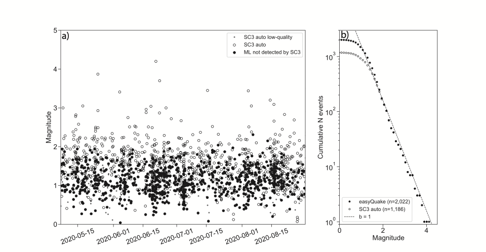
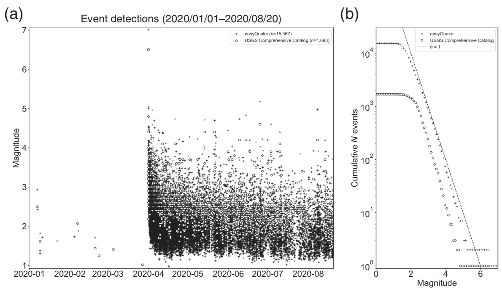

.. _About:
  
***************
About
***************
Background
-----------

The easyQuake package combines earthquake waveform download, event detection at individual stations, event association, magnitude determination, and absolute location with hypoinverse.

Each module in the easyQuake package is called, individually, with a driver script and we include several example driver scripts in these docs and in the Github repository: https://github.com/jakewalter/easyQuake

The easyQuake platform utilizes a choice between the GPD picker (Ross et al., 2018), EQTransformer (Mousavi et al., 2020), PhaseNet (Zhu and Beroza, 2019), and SeisBench (Woollam et al., 2022) deep-learning pickers and easyQuake will utilize the default models for those pickers. However, in most circumstances, you may want to train your own picker if you have a sufficient dataset for your experiment or region of interest.

It then takes those picks and utilizes a modified version of the Python-based PhasePApy (Chen and Holland, 2016) 1D associator. The associated events can then be passed through easyQuake modules to get a local magnitude, an absolute location from Hypoinverse, and output pick information in various formats for relative relocation (e.g. HypoDD). All the relevant metadata (picks, station amplitudes, station magnitudes, origins from association and Hypoinverse) is aggregated into a QuakeML format and can be output as an Obspy catalog or single event QuakeML file.

In implementation at OGS, we use the single event QuakeML file and add that directly into our SeisComP system via the quasi-realtime workflow described below and the `sceasyquake` native SeisComP module.

Detection Improvement
----------------------

At OGS, we run the seismic network and create scientific products (location, magnitude, etc.) that are released through USGS as part of our membership in the national Advanced National Seismic System (ANSS). In adding easyQuake to augment detection, we have found a factor of 2 more earthquakes since May 2020.

In addition, as a test scenario, we can run it on FDSN-downloaded waveforms and find significant detection improvement relative to the regional seismic network in the case of the March 2020 M6.5 Central Idaho earthquake

Quasi-Realtime Mode
--------------------

easyQuake includes a quasi-realtime earthquake detection workflow in the ``realtime/`` directory of the repository. Rather than processing full daylong files, the realtime scripts receive short data packets from a SeedLink server and trigger the detection/association pipeline on each new snippet as it arrives.

**Key scripts:**

* ``rt_easyquake.py`` — Main realtime loop that watches for ``rt.xml`` trigger files written by the SeedLink client. When a new time window of data is available it spawns a background thread that calls ``detection_association_event``. An hourly periodic re-scan catches any windows that were missed. Detected events are written as SeisComP-compatible ``*_seiscomp.xml`` files.

* ``seedlink_connection_v5.py`` — SeedLink client that connects to a server, receives waveform packets, and writes them into the project folder structure used by the detection loop.

* ``seedlink_sds_connection.py`` — Alternate SeedLink client that writes data into an SDS (SeisComP Data Structure) archive layout.

**Ingesting into SeisComP (external dispatch):**

If you have a SeisComP instance running on another server, the simplest approach is an ``inotify``-based dispatcher that watches the directory where ``rt_easyquake.py`` writes its ``*_seiscomp.xml`` files and calls ``scdispatch`` automatically::

    #!/bin/bash
    inotifywait -m /home/sysop/incoming_ML -e create -e moved_to |
        while read directory action file; do
            if [[ "$file" =~ .*xml$ ]]; then
                scdispatch -i "${directory}${file}" -O add
                rm "${directory}${file}"
            fi
        done

Run this as a background process or systemd unit on the SeisComP server. See ``realtime/README.md`` for full details.

For fully native integration — where easyQuake picks are published directly to the SeisComP messaging bus — see the **SeisComP Integration** section below.

SeisComP Integration
---------------------

For users running a SeisComP seismic network management system, easyQuake ML picks can be published directly to the SeisComP messaging bus as native ``Pick`` objects, making them available to ``scautoloc``, ``scevent``, and other SC modules as if they came from ``scautopick``.

This is provided by the companion module **sceasyquake**: https://github.com/jakewalter/easyQuake_seiscomp

``sceasyquake`` is a SeisComP 5 module that:

* Connects to a SeedLink server and buffers incoming waveforms per channel
* Runs continuous ML phase picking (P and S) using any of the supported backends
* Publishes picks and SNR amplitudes to the SC messaging ``PICK`` group in real time
* Works as a drop-in companion to ``scautopick`` — both can run simultaneously

**Supported backends:**

+----------------+-----------------+----------------------------------------------+
| Backend        | Model           | Notes                                        |
+================+=================+==============================================+
| phasenet       | PhaseNet        | easyQuake native, TF >= 2.12                 |
+----------------+-----------------+----------------------------------------------+
| gpd            | GPD             | threshold default 0.994 (easyQuake default)  |
+----------------+-----------------+----------------------------------------------+
| eqtransformer  | EQTransformer   | P + S + detection confidence                 |
+----------------+-----------------+----------------------------------------------+
| seisbench      | any SeisBench   | configurable via ``picker.model``            |
+----------------+-----------------+----------------------------------------------+
| auto           | PhaseNet (SB)   | auto-selects best available backend          |
+----------------+-----------------+----------------------------------------------+

**Architecture:**

The module subscribes to a SeedLink stream and performs a single GPU forward pass per step interval (default 5 s) covering all subscribed stations simultaneously. On an NVIDIA RTX 2070 Super, PhaseNet comfortably handles 1000+ simultaneous streams within a 5 s step. See the `sceasyquake README <https://github.com/jakewalter/easyQuake_seiscomp>`_ for benchmarking results and configuration details.

**Quick install:**

.. code-block:: bash

    git clone https://github.com/jakewalter/easyQuake_seiscomp.git
    cd easyQuake_seiscomp/sceasyquake
    export SC_PYTHON=$(seiscomp exec which python3)
    $SC_PYTHON -m pip install obspy seisbench
    $SC_PYTHON -m pip install -e ~/easyQuake   # optional: bundled weights
    bash install.sh
    seiscomp enable sceasyquake
    seiscomp start sceasyquake

Version History
----------------

* **Version 2.0 (April 2026):** Major modernization. Python 3.10+ required. All ML backends rewritten for TensorFlow >= 2.12 and PyTorch >= 1.13. SeisBench integration. Quasi-realtime workflow promoted from beta to stable. ``sceasyquake`` native SeisComP module released as companion repository.

* **Version 1.4 (September 2024):** PyOcto association conversion to QuakeML; SeisBench picker integration (beta).

* **Version 1.3 (November 2022):** PhaseNet picker added alongside GPD and EQTransformer. Numerous bug fixes.

* **Version 1.2 (August 2022):** Rewrote STA/LTA non-ML picker using ``recursive_sta_lta`` from obspy.

* **Version 0.9 (February 2022):** ``cut_event_waveforms`` and ``quakeML_to_hdf5`` utilities added.

* **Version 0.8 (July 2021):** Several major bug fixes and improved controls for Hypoinverse location.

* **Version 0.6 (February 2021):** Choice of GPD or EQTransformer pickers.

* **Version 0.5 (February 2021):** Embedded Hypoinverse location functionality.

References
-----------

* Chen, C., and A. A. Holland (2016), PhasePApy: A Robust Pure Python Package for Automatic Identification of Seismic Phases, Seismological Research Letters, 87(6), doi: 10.1785/0220160019.

* Mousavi, S.M., Ellsworth, W.L., Zhu, W., Chuang, L.Y., Beroza, G.C. (2020), Earthquake Transformer: An Attentive Deep-learning Model for Simultaneous Earthquake Detection and Phase Picking, Nature Communications.

* Ross, Z. E., M.-A. Meier, E. Hauksson, and T. H. Heaton (2018), Generalized seismic phase detection with deep learning, Bull. Seismol. Soc. Am., 108, doi: 10.1785/0120180080.

* Walter, J. I., P. Ogwari, A. Thiel, F. Ferrer, and I. Woelfel (2021), easyQuake: Putting machine learning to work for your regional seismic network or local earthquake study, Seismological Research Letters, 92(1): 555–563, https://doi.org/10.1785/0220200226.

* Woollam, J., Münchmeyer, J., Tilmann, F., Rietbrock, A., Lange, D., Bornstein, T., Diehl, T., Giunchi, C., Haslinger, F., Jozinović, D., Michelini, A., Saul, J., and Soto, H. (2022), SeisBench — A toolbox for machine learning in seismology, Seismological Research Letters, 93(3): 1695–1709, https://doi.org/10.1785/0220210324.

* Zhu, W., and G. C. Beroza (2019), PhaseNet: a deep-neural-network-based seismic arrival-time picking method, Geophysical Journal International, 216(1): 261–273, https://doi.org/10.1093/gji/ggy423.
